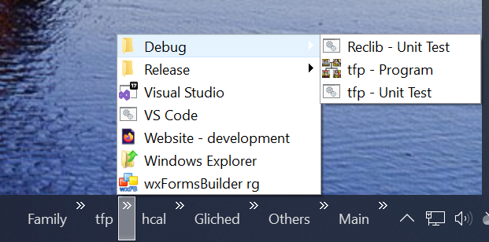
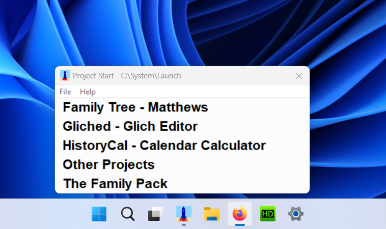
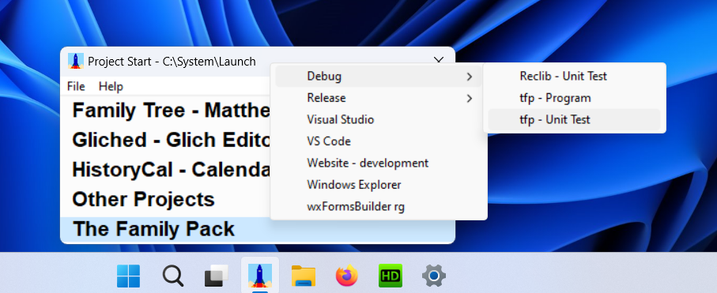

# ProjectStart -  Launching Your Projects

### Version 0.0.1 - Initial Release

This Windows program is designed to open programs and documents
associated with your projects.
It can be pinned to the taskbar and used when starting work on your project
or running project related tasks.
It can replace the Windows 10 taskbar toolbars.

### Windows 10 Taskbar Toolbars

If you are not familiar with the confusingly named taskbar toolbars,
then right click on the Windows 10 taskbar,
the topmost option is 'toolbars'.
Clicking on this option gives the option of several standard directories,
and at the bottom the option 'New toolbar...'.
Clicking this option allows you to select any directory to use as a 'toolbar'
Once selected, it shows on the right hand side of the taskbar
as the name of the directory followed by a chevron '>>' button.
If you use this button, it gives a popup menu of all the items in the directory.

I have made use of these toolbars for my own projects.
The directories can pe populated with shortcuts to documents
and batch files/scripts etc.
For instance, my C++ project "The Family Pack" has a file 'tfp.sln'.
By right clicking on this file you can create a shortcut file.
Copy this shortcut to The Family Pack toolbar directory
and rename it 'Visual Studio'.
Now from the taskbar, click on the 'tfp' toolbar
and select the 'Visual Studio' option.
The Visual Studio program will be started
with The Family Pack code already loaded and ready to go.

Other routine tasks can be set up and carried out directly from the toolbar.
Such as running the latest debug version of the program,
or running unit tests.

I find them very useful,
particularly for projects where I am more interested in documents
rather than programs.
Unfortunately however,
this feature has not been carried over to Windows 11
and hence, ProjectStart.

### ProjectStart

The ProjectStart app replaces all the taskbar toolbars
with a single app pinned to the the taskbar.
Once set up, clicking on taskbar app pops up
a list of all the main projects you are working on.

Clicking on one of projects pops up a menu of all the shortcuts etc.
that have been created for that project.

Clicking on a menu option then launches the shortcut
and closes the ProjectStart app.

### How it Works

Somewhere on your file system you setup a directory
containing a directory for each of your main projects.
If you have a number of smaller projects,
they can be grouped together in an "Other Projects" directory.

Populate the project directories with shortcuts to your
projects documents and batch/script files.

Install the ProjectStart app and pin it to the taskbar.

### Initial Set Up

Set up an environment value:-

Settings - System - About - "Advanced system settings"

PROJECTSTART=\<initial-directory>

Open the ProjectStart application and pin it to the taskbar.

If on first run of the ProjectStart app
there is a problem with missing dll's, go to:-

https://answers.microsoft.com/en-us/windows/forum/all/vcruntime140dll-and-msvcp140dll-missing-in-windows/caf454d1-49f4-4d2b-b74a-c83fb7c38625

ProjectStart requires the x64 version.

### Future Enhancements

Improve setup procedure by presenting a dialog on app's initial run.
Use the registry instead of an environment value.

Allow the order of menu items to be set.
(Currently alphabetical order.)

Ignore shortcut file extension.

Add program icons to the menu items.

Don't require a single directory tree structure.
This will allow some of the Windows standard toolbars can be used.
It will will also allow the shortcut directories
to be part of the projects own file structure.
